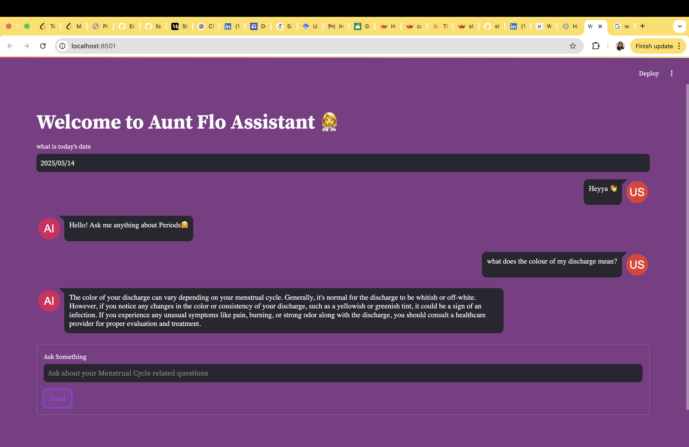

## llama2 Streamlit Aunt Flo Assistant 🦙🤖

## 📂 Contents

- [Introduction](#Introduction)
- [Project Overview](#ProjectOverview)
- [Demo](#Demo)
- [Prerequisites](#Prequisites)  
- [Installation](#Installation)
- [Getting Started ](#GettingStarted ) 
- [Acknowledgement](#Acknowledgement)  
- [License](#License)
   

  ## Introduction
     A lightweight, CPU-friendly chatbot for women's health education

     This repository hosts the Aunt Flo Assistant, a conversational AI chatbot powered by the LLaMA-2-7B-Chat model (quantized using GGML), optimized to run efficiently on CPU-only, low-resource 
     machines. The assistant is delivered via a Streamlit web application, offering an intuitive and user-friendly interface that makes interaction smooth and accessible without the need for GPU 
     or cloud deployment.
     The core inspiration behind this assistant stems from the need for an affordable, private, and responsive chatbot that can sustain contextual conversation, something often lacking in basic 
     rule-based or stateless bots. By using the quantized version of LLaMA-2-7B-Chat, we bring powerful language generation capabilities to users without requiring specialized hardware.


  ## Project Overview
     The repository contains all the necessary code and assets to set up and run a 
     Streamlit-based Chatbot with Memory, powered by the LLaMA-2-7B-Chat (Quantized GGML) model. Below is a brief overview of the key components:

     - ingest.py: Handles the data pipeline. It loads PDF documents, splits the text into smaller word-based chunks, and creates a FAISS vectorstore database that is later used by app.py for 
       document retrieval during chat.

     - app.py: The main Streamlit web application. It provides a clean, interactive interface where users can chat with the LLaMA 2-based assistant. It maintains conversation history using 
       LangChain’s memory module for context-aware responses.

     - llama-2-7b-chat.ggmlv3.q4_0.bin: These are the quantized model weights, optimized for CPU inference. The model is provided by TheBloke and can be manually downloaded from Hugging Face.

     - requirements.txt: A list of required Python packages and libraries needed to run the application in a virtual environment.

  ## 🎥 Demo
     
     
     [Click here for a live demo]() 
  
  
  ## Prequisites
     Before running the Streamlit Chatbot with Memory, you need to have the following installed:

     - Python (version 3.10)

  ## 🛠️ Installation
     To run the chatbot locally, follow these steps:

     - ## Clone the repository:
       ``` bash
           git clone https://github.com/sfansaria/llama2-streamlit-Aunt-Flo-Assistant.git
       ``` 
       ``` bash
           cd Aunt_Flo_Assistant
       ```
  
     - ## Create and activate a virtual environment: 
       ```bash
          conda create -p AIchatBot python==3.10 --y
       ```
       ```bash
          conda activate AIchatBot
        ```
       ```bash
          source AIchatBot/bin/activate
       ```  
     - ## Install the required dependencies:
       ``` bash
           pip install -r requirements.txt
       ```

  ## GettingStarted
     To run the Streamlit Chatbot with Memory, execute the following command:
     ```bash
        streamlit run app.py
     ```
     This will start the Streamlit server, and you can access the chatbot interface by opening your web browser and navigating to http://localhost:8501.

Simply type your messages in the input box and press "Enter" to send them to the chatbot or click on the send button. The chatbot will respond based on the context of the conversation, thanks to its memory capabilities.

 
  

  ## Acknowledgement
     - This project uses the quantized GGML version of LLaMA-2-7B-Chat, provided by TheBloke. Huge thanks for making this accessible to the community!
     - Thank you for your interest in this project!
       Feel free to open issues, submit pull requests, or share feedback — your contributions are always welcome.

Happy chatting! 🤗

  ## License
     This project is licensed under the MIT License.


## Useful Links 🔗

**Knowledge Base:** 
- [LINK 1] (https://cdn.bookey.app/files/pdf/book/en/period-power.pdf)
- [LINK 2] (https://cdn.bookey.app/files/pdf/book/en/it-starts-with-the-egg.pdf)
- [LINK 3] (https://www.heygirls.co.uk/wp-content/uploads/2023/06/A5-TOTM-BOOK-.pdf)

Hope you get the answers! 💻😊

